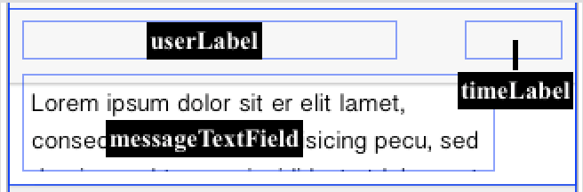
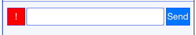
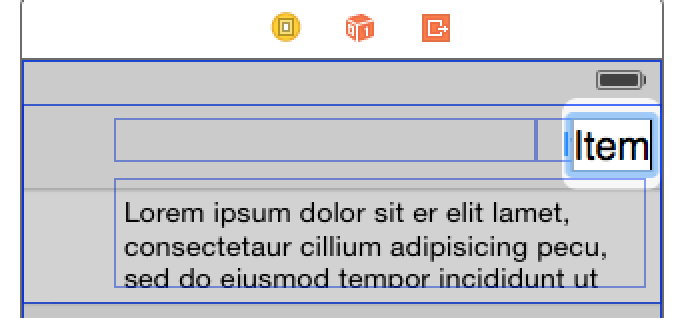

#Simple Swift Chat App

Mobile developers everywhere are going mad for Apple's new programming language, Swift. Swift is concise, relative to Objective-C, in that the same functionality can be created in fewer lines of code. This fast and efficient "iLanguage" provides real-time feedback and can be seamlessly incorporated into existing Objective-C code. So not only are developers able to write safer, more reliable code. They’re able to save time and, ultimately, create even richer app experiences. 

To complement the speed and ease of Swift, PubNub has released our own brand new iOS SDK which is now even simpler and about 95% leaner. 

In this tutorial I am going to walk you through building a simple chat app in Swift which will showcase many of PubNub's features such as 
	
* **Publish** - to send our messages to others
* **Subscribe** - to receive messages from others
* **Storage & Playback** - so we can view previously published messages 
* **Presence** - so we can see when friends enter and leave the chat
* **Mobile Push Notifications** - to PING the entire channel with a Push Notification

	
	
Before we begin, you will need to check out our [Swift Quick Start](http://www.pubnub.com/blog/realtime-ios-apps-getting-started-with-swift-and-pubnub/) for a super simple tutorial on how to set up PubNub with your Swift project. From the tutorial you will need the Objective-C Bridging-Header and PubNub Pods.

After you have done that, create a new Project and name it PubChat. 

The first thing we will do is create the UI for our chat app.

##Setting Up Our View Controller

To begin, lets go into our `Main.storyboard` where you should see just a default View Controller. Click `Editor->Embed In-> Navigation Controller`. 

Next grab a Table View from the Object library and place it on the View Controller. Click on the assistant editor and Control-Drag the Table View to the  `ViewController.swift`, name it `MessageTableView`. 

Close the Assistant editor, we will now format our Table View Cell to look like a chat message. Click on `MessageTableView` in the storyboard and on the right side check out the Attributes Inspector. Find where it says Prototype Cells and set it to 1. On the Storyboard you should now see a blank cell appear on the `MessageTableView`. Drag and make the Cell a little larger (I set mine to Row Height: 100). Next, go into the Identity Inspector and set class to `MessageTableViewCell` and also set the Cell identifier to "Cell". We now need to define our Custom Cell class so go to `File -> New -> File... -> Cocoa Class` set Class to `MessageTableViewCell` and Subclass to "UITableViewCell" then create.

Back on the storyboard I am going to drag a few elements onto `MessageTableViewCell` :
	
* 2x UILabel
* Text Field

My cell looks like this:

 
 
Open the assistant editor and lets connect our elements to `MessageTableViewCell.swift`. We name the top left label `userLabel`, which will be where the username is displayed. The top right label we name `timeLabel`, which will display the message timestamp. And last the text field we name `messageTextField`, will display the chat message.
 
We now need to add components so we can type & send messages also a PING button. This is done by using 2x UIButtons and 1 UITextField. 

Drag a textfield, and two buttons onto your storyboard and place them beneath your table view. After very minimal styling my set up looks like this:

 

Connect these components to the View Controller and name them sendButton, compostTextView and pingButton.

 And lastly, we drag a Button to the top right of the Navigation Bar like so:
 
  
 
Connect this button to the View Controller and name it occupancyButton.
 
 If we connected everything properly our ViewController right now should have the following added to it:
 

    
And our `MessageTableViewCell.swift` should now have:

    
Just like that our UI is fully setup and we can start implementing our PubNub functionality.

##Basic PubNub-ery

First lets visit `AppDelegate.Swift`. Simply add the following line beneath the class declaration: 

    var client:PubNub?

Throughout our project we will access this instance of PubNub, named client. That is it for our AppDelegate. Lets go back into our ViewController.

Our TableView is going to contain all of the messages on the channel we are subscribed to, where each individual cell has a username, time stamp and message. 

Lets first go ahead and add all the necessary protocols to our ViewController which we will need. Paste the following onto the top of your class declaration:

	class ViewController:UIViewController, UITextFieldDelegate, UITableViewDelegate, UITableViewDataSource, PNObjectEventListener{

Next, go into your `viewDidLoad()` function and add the following:
    	
        self.composeTextField.delegate = self
        MessageTableView.dataSource = self
        
        self.title = "PubChat Demo"
                
        updateTableview()
        showIntroModal()

For now, do not worry about updateTableview() & showIntroModal() because we will define them soon. We need to add all the necessary TableView functions so copy and paste the following:

Above our class declaration we are going to add a few things.

We create a class called chatMessage which has a String "name", String "text", String "time" and String "type". We will also create a function which will turn our chatMessage instance into a Dictionary which we can `publish` with PubNub. And last we will be needing a few global variables so paste the following:

Its good practice to modularize parts of your code, so here we create a function which we will call when we want to initialize our PubNub instance:

We will now need to define a few more functions, a function which will take care of joining new channels, a function which will handle our channel's `history` requests to load old messages from the channel, lastly a function to Parse our JSON packets we receive from PubNub into strings.

So beneath initPubNub() add the following:

Now lets create a function for when we press our sendButton. Paste the following and connect your sendButton from your storyboard to this function:

Now we can go back and set up our TableView functions.

Lets check out `cellForRowAtIndexPath` and change it to look like this:

  
  
  Change numberOfRowsInSection to this 

	func tableView(tableView: UITableView, numberOfRowsInSection section: Int) -> Int {
        return chatMessageArray.count;
    }
    
Now when our app loads all messages in ChatMessageArray will be added as a cell to our table view. We will now need to set up our callback for when a new publish is received on the channel we are subscribed to. To do so, paste the following into your code:

 
 
 

      
We also want to be information about `Presence` events on the channel so we add the following to our code:
 
     
    
Try running your code you should now see all past messages on your channel appear in the table. You are also able to post and receive new messages, and see all presence events as they happen all in real time!

We probably want to see a little more about who is `Here Now` in our room so add the following code and connect your occupancyButton to the function occupancyButtonTapped:

 
You will see in the top right a number which shows how many people are currently in that chat room right now. This number will change in realtime. If you click on it a list of all the users present pops up as a modal. 

Last, we want to send Push Notifications each time the PING! button is pressed. 

Before we go any further it is very important that you set up push notifications for your project through Apple. If you have never done this before there are clear instructions on how to do so at: <https://developer.apple.com/library/ios/documentation/IDEs/Conceptual/AppDistributionGuide/ConfiguringPushNotifications/ConfiguringPushNotifications.html> This will require you have an Apple dev membership and getting a few .certs. For a first timer this can be a headache but unfortunately must be done for all iOS apps which will use push notifications. 

You will also need to enable Push Notifications on your PubNub account. This can be done at <https://admin.pubnunb.com>

Now then...

Lets go back into our `joinChannel()` function and above our `hereNowForChannel` call add:

	var pushChannel = channel + "push"
    appDel.client?.addPushNotificationsOnChannels([pushChannel], withDevicePushToken: deviceToken as! NSData, andCompletion: nil)

If you haven't yet, control drag the PING button to your `ViewController` and create a button tap action named `alertButtonTapped`.

Define your function to look like this: 

If you have successfully set up APNS in your Apple Developer Portal, and provided the correct cert for PubNub Push Notifications then you should now be able to PING everyone in the chat by pressing the alert button! 

Now we have successfully incorporated Pub/Sub, Presence, Storage & Playback, and Push Notifications to make our very own chat app in Swift! There is however so much more you can still do. In my GitHub repo I have made a demo which allows users to change their username, enter any chatroom they want, places a green indicator light next to messages from who are currently in the room, and uses a scroll view to move the textfield above the keyboard. 

Feel free to check my repo and see how I do it.
